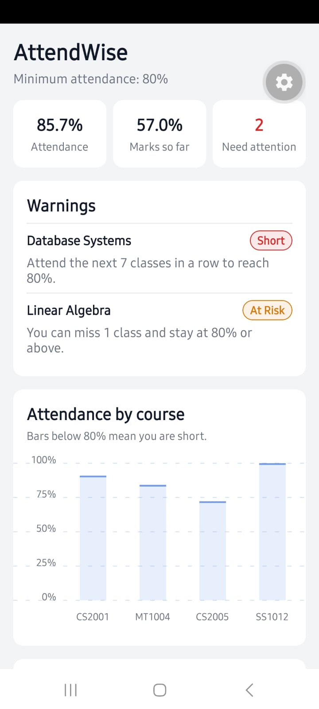
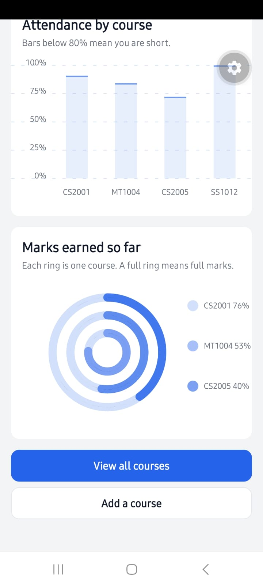
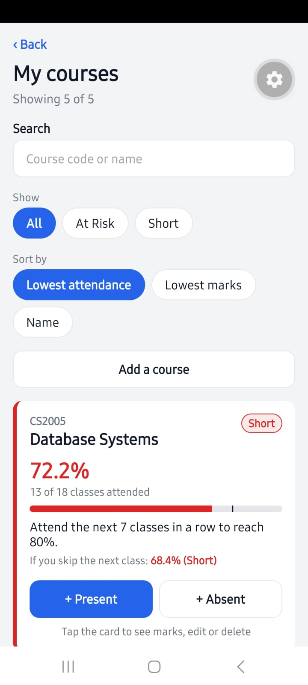
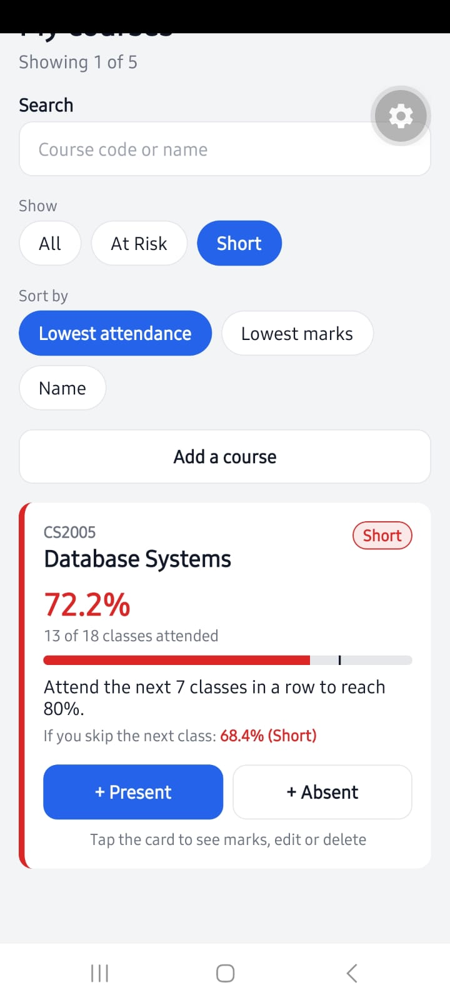
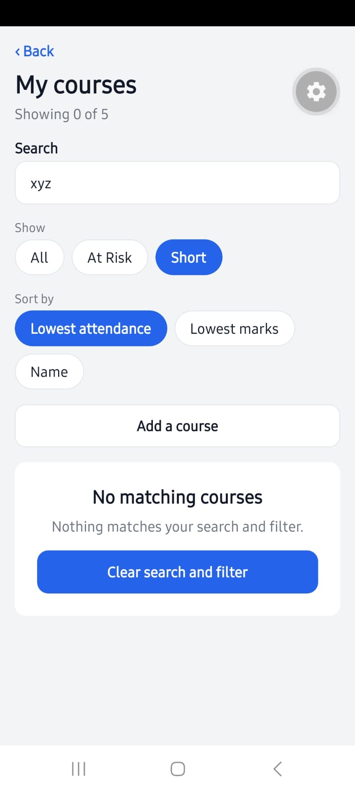
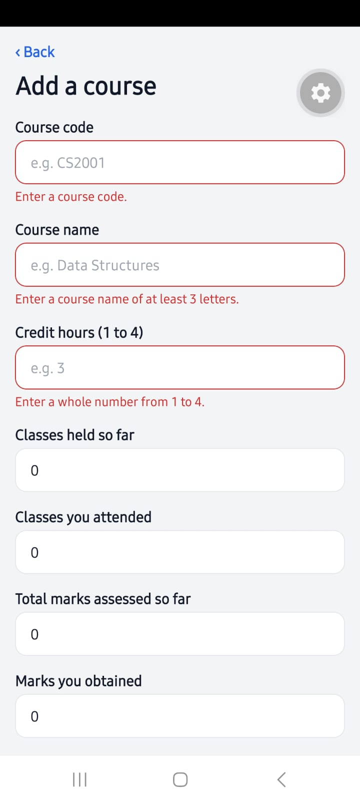
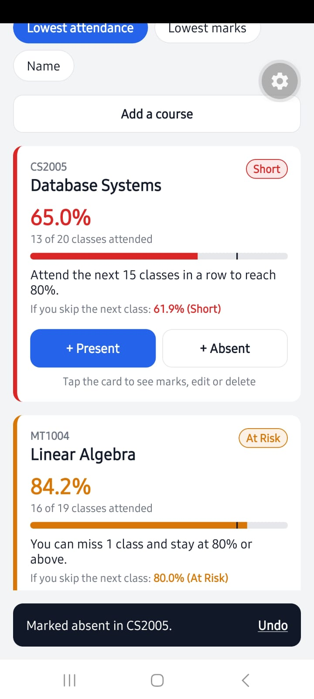
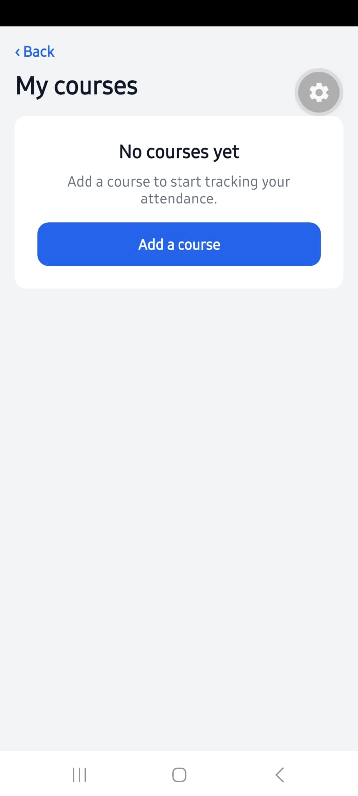

# AttendWise

An attendance and marks tracker that tells university students, before it is too late, whether they can afford to miss a class.

**Course:** Software for Mobile Devices, Assignment 1
**Author:** Burhan Aslam 23I-3097

## The problem

Students usually discover they are short on attendance only after the portal shows a low percentage, and by then it may be too late to recover. Portals like FLEX show raw numbers such as "18/24", but they do not answer the questions students actually ask: *"Can I miss tomorrow's class?"* or *"How many classes must I attend to get back above the limit?"* Marks are also spread across courses, so it is hard to see which subject needs attention first.

## The solution

AttendWise lets a student record their courses, attendance and marks, and mark each class as Present or Absent with one tap. For every course it calculates the attendance percentage, a status (Safe, At Risk or Short), how many more classes the student can miss, or how many classes in a row they must attend to recover. A dashboard with charts and warnings shows at a glance which courses need attention, and everything updates the moment the data changes.

## Features

- **One-tap attendance:** "+ Present" and "+ Absent" buttons on every course card.
- **Can miss / must attend:** each card says exactly how many classes can still be missed, or how many must be attended in a row to reach the minimum.
- **"If you skip the next class" preview:** shows the percentage and status the course would have after one more absence, before the student decides to skip.
- **Status per course:** Safe, At Risk (within 5% of the limit) or Short, shown with colors and badges.
- **Dashboard:** overall attendance, marks so far, number of courses needing attention, a warnings list, a bar chart of attendance per course, and a progress (ring) chart of marks per course.
- **Search, filter and sort:** search by course code or name, filter by At Risk or Short, sort by lowest attendance, lowest marks or name.
- **Add and edit courses:** one form, reused for adding and editing, with validation and clear error messages.
- **Delete with confirmation**, and an **Undo** bar for the last attendance tap.
- **Empty and edge states:** no courses, no classes held yet, no marks yet, and no search results are all handled without errors.
- **Android back button** returns to the previous screen.

Data is kept in memory and resets when the app is reloaded; saving data was not required for this assignment.

## Built with

- React Native and JavaScript, using **Expo SDK 57**
- **react-native-chart-kit** (Bar chart and Progress chart) with react-native-svg
- react-native-safe-area-context

Screens are switched with a `useState` variable and conditional rendering. No navigation library, tab bar or side drawer is used.

## How to run

1. Install [Node.js](https://nodejs.org) (LTS version).
2. Install **Expo Go** on your phone from the Play Store or App Store. The project uses Expo SDK 57, so Expo Go must support SDK 57.
3. Download or clone this repository, then open a terminal in the project folder and run:

   ```bash
   npm install
   npx expo start
   ```

4. Scan the QR code with Expo Go (Android) or the Camera app (iPhone). The phone and computer must be on the same Wi-Fi.

If the phone cannot connect, run `npx expo start --tunnel` instead, or allow Node.js through the Windows Firewall.

## Changing the rules

All limits are in `src/constants/settings.js`:

| Setting | Default | Meaning |
|---|---|---|
| `ATTENDANCE_THRESHOLD` | 80 | Minimum attendance % |
| `WARNING_MARGIN` | 5 | How close to the limit counts as "At Risk" |
| `LOW_MARKS_THRESHOLD` | 50 | Marks % shown as low |
| `UNDO_SECONDS` | 5 | How long the Undo bar stays visible |

## Project structure

```
App.js                  App state and screen switching
src/
  constants/
    settings.js         Thresholds, statuses, filter and sort options
    theme.js            Colors, spacing, font sizes
  data/
    initialCourses.js   Sample courses
  utils/
    calculations.js     Percentages, status, can-miss and must-attend
    advice.js           The advice sentence for each course
    validation.js       Form validation rules
    courseListHelpers.js  Search, filter and sort
  components/           Reusable UI: AppButton, ScreenHeader, StatusBadge,
                        StatBox, ChartCard, OptionChips, FormField,
                        EmptyState, CourseCard, UndoBar
  screens/
    DashboardScreen.js
    CoursesScreen.js
    CourseFormScreen.js
screenshots/            App screenshots
```

## Screenshots

| Dashboard | Charts | Courses |
|---|---|---|
|  |  |  |

| Card opened | Short filter | No search results |
|---|---|---|
|  |  |  |

| Form validation | Undo bar | Empty state |
|---|---|---|
|  |  |  |

## AI usage

AI (Claude) was used for planning, code generation, explanations and debugging. All code was tested on a real Android phone. Details are in the AI Usage Report.